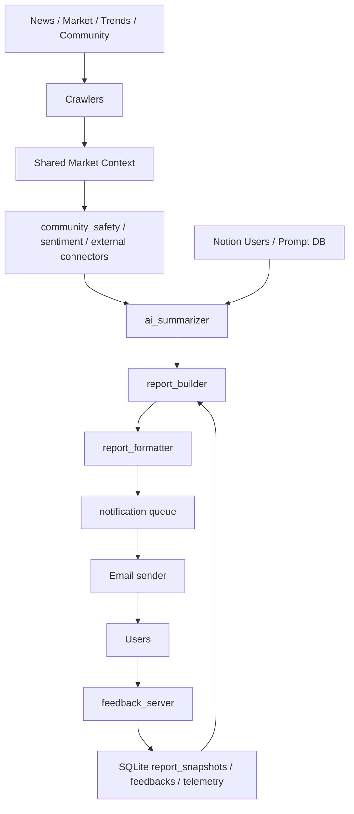

# Stock Report Automation

한국 주식시장 데이터를 자동 수집하고, Google Gemini로 구조화 요약한 뒤, 사용자별 맞춤 리포트를 이메일로 발송하는 비동기 파이프라인입니다. 현재 리포트는 "최근 동향 -> 일간 요약 -> 주간 반복 신호 -> 월간 장기 판단" 순서로 읽히도록 재구성되어 있으며, 상단에는 이전 2회 리포트 대비 주요 변경점이 노출됩니다.

## 현재 구현 상태

- 공통 데이터는 한 번만 수집하고, 사용자별로 관심 키워드/보유 종목 뉴스만 추가 수집합니다.
- AI 출력은 장문 자유서술보다 짧은 구조화 섹션 중심으로 제한합니다.
- 커뮤니티 입력은 allowlist + 비속어/민감정보 필터를 거친 안전한 데이터만 사용합니다.
- 사용자 리포트 이력은 SQLite에 저장되어 헤드라인 변화, 1H/1D/1W/1M 타임윈도우, 장기 플랜 생성에 재사용됩니다.
- GitHub Actions는 `STOCK_DB_PATH` 기반 SQLite 캐시를 복구/저장하며 실행 전후 health check를 수행합니다.
- 알림 채널은 현재 `email`이 운영 경로이고, Telegram 전송 레이어는 코드상 준비돼 있으나 메인 파이프라인에서는 비활성화되어 있습니다.

## Codex / 신규 기여자 읽기 순서

이 저장소는 문서보다 진입점 몇 개를 읽는 편이 빠릅니다.

1. `AGENTS.md`
2. `README.md`
3. `src/main.py`
4. `src/services/ai_summarizer.py`
5. `src/services/report_builder.py`
6. `src/utils/report_formatter.py`
7. `src/utils/database.py`
8. `src/services/community_safety.py`
9. `src/services/topic_news.py`
10. `tests/test_e2e_dryrun.py`

작업 전 상태 확인 기본 순서:

```bash
cat todo/todo.md
ls -t logging/ | head -1 | xargs -I{} cat logging/{}
git status --short --branch
git config --get core.hooksPath
uv run python -m pytest tests/services/ tests/test_e2e_dryrun.py -q
```

## 아키텍처 개요



### 런타임 흐름

1. `src/main.py`가 소스 정책을 검증하고 프롬프트 캐시를 예열합니다.
2. 시장 지수, 공통 뉴스, 커뮤니티, 데이터랩 트렌드를 `asyncio.gather`로 병렬 수집합니다.
3. 커뮤니티 데이터는 `src/services/community_safety.py`에서 필터링합니다.
4. 공통 시황 요약은 `src/services/ai_summarizer.py`가 생성합니다.
5. 사용자 목록은 Notion에서 페이지네이션으로 읽습니다.
6. 각 사용자에 대해 관심 키워드/보유 종목 뉴스만 추가 수집합니다.
7. AI는 테마 요약과 보유 종목별 인사이트를 생성합니다.
8. `src/services/report_builder.py`가 직전 리포트 스냅샷과 비교해 헤드라인 변화와 타임윈도우 payload를 만듭니다.
9. `src/utils/report_formatter.py`가 최종 Markdown을 렌더링하고, 발송 전 SQLite에 스냅샷을 저장합니다.
10. 발송 후 사용자는 HMAC 서명된 피드백 링크를 통해 평가를 남기고, 피드백은 다시 SQLite에 누적됩니다.

## 리포트 구조

현재 리포트의 의도는 "5~10분 내 파악 가능한 운영형 리포트"입니다.

- `헤드라인 변화`: 직전 2회 리포트 대비 감정 점수, 장세 톤, 새 테마, 보유 종목 대응 변화
- 각 카드 공통 구조: `한줄 판단 -> 핵심 근거 -> 왜 중요한가 -> 지금 볼 것 -> 세 가지 시각 -> 다음 체크포인트`
- `지금 바로 볼 것`: 가장 최근 시장 포인트 2~3개
- `1H / 1D / 1W / 1M`: 최근 뉴스, 오늘 장 마감, 최근 1주 반복 신호, 최근 1개월 장기 판단
- `데이터 신뢰도`: 최근 7일 외부 커넥터 성공률, 평균 지연, 최근 오류 사유, 일자별 품질 표
- `외부 지표 해석`: OpenDART/FRED/SEC 1D/7D 변화율을 쉽게 풀어쓴 해석 카드
- `관심 테마 요약`: 키워드별 2~3개 bullet
- `보유 종목별 인사이트`: 종목별 상태, 핵심 근거, 액션 한 줄
- `장기 플랜`: 월간 누적 신호와 데이터 신뢰도를 반영한 추적 계획

## 디렉토리 맵

```text
src/
  main.py                         메인 파이프라인 진입점
  models.py                       DTO 모음
  crawlers/                       뉴스/시장/커뮤니티 수집기
  services/
    ai_summarizer.py              Gemini 호출, JSON 모드, fallback
    report_builder.py             리포트 payload 조립, 스냅샷 비교
    topic_news.py                 키워드/보유 종목 뉴스 병렬 수집
    community_safety.py           커뮤니티 allowlist / 민감 표현 필터
    user_manager.py               Notion 사용자 조회 + pagination
    market_external_connectors.py 무료 외부 소스 텔레메트리 수집
    connector_alerts.py           외부 커넥터 1H/24H 운영 알림 평가
    notifier/                     이메일/텔레그램/큐 워커
  utils/
    report_formatter.py           구조화 payload -> Markdown/HTML
    database.py                   SQLite 영속화, self-healing, runtime counts
    cache.py                      TTL 캐시
    deduplicator.py               뉴스 중복 제거
    sentiment.py                  감정 점수 산출
tests/
  services/                       서비스 계층 회귀 테스트
  test_e2e_dryrun.py              외부 API 없이 핵심 데이터 흐름 검증
.github/workflows/
  pr_quality_gate.yml            PR 단계 품질 게이트 + 문서 동기화 검증
  report_scheduler.yml            3시간 주기 실행 + SQLite 상태 복구
scripts/
  check_runtime_state.py          SQLite health check
  check_context_sync.sh           코드/문서 동기화 점검
  check_commit_size.sh            커밋 400줄 제한 검증
```

## 데이터 저장소

### Notion

- 사용자 구독 정보: `NOTION_DATABASE_ID`
- 프롬프트 템플릿: `NOTION_PROMPT_DB_ID`

Notion은 운영 입력 저장소입니다. 실행 중 누적되는 운영 상태는 Notion이 아니라 SQLite에 저장합니다.

### SQLite

- 기본 경로: `data/stock_project.db`
- 오버라이드: `STOCK_DB_PATH`
- 주요 테이블:
  - `feedbacks`
  - `prediction_snapshots`
  - `report_snapshots`
  - `prompt_usage_log`
  - `external_connector_runs`
  - `connector_alert_events`
  - `connector_metric_points`

`src/utils/database.py`는 WAL 모드, 손상 복구, close 시 checkpoint, 경로 기반 싱글톤 재초기화를 처리합니다.

## GitHub Actions 동작 방식

`/.github/workflows/report_scheduler.yml`은 3시간마다 실행되며 다음을 보장합니다.

1. `STOCK_DB_PATH` 기준 SQLite 디렉토리를 준비합니다.
2. 직전 DB 캐시(`.db`, `-wal`, `-shm`)를 복구합니다.
3. 실행 전 `scripts/check_runtime_state.py`로 DB 상태를 점검합니다.
4. `uv run python -m src.main`으로 리포트 파이프라인을 실행합니다.
5. 실행 후 다시 DB 상태를 점검하고 캐시를 저장합니다.

이 구조 덕분에 stateless runner에서도 리포트 스냅샷과 피드백 누적값을 이어갈 수 있습니다.

`/.github/workflows/pr_quality_gate.yml`은 PR 단계에서 실제 PR head commit을 기준으로 `run_quality_gate.sh`를 실행해 pytest와 문서 동기화 검증을 강제합니다.

## 안전 장치

- `community_safety.py`: 기본 allowlist는 보수적으로 운영하며 고위험 커뮤니티 표현은 제거합니다.
- `safe_gemini_call()`: semaphore, 재시도, circuit breaker, 모델 자동 대체를 포함합니다.
- `feedback_server.py`: HMAC 서명 검증 없이는 피드백을 받지 않습니다.
- `database.py`: 손상 DB 발견 시 백업 후 재생성합니다.
- `market_source_governance.py`: 무료 소스 정책/호출량을 실행 전 점검합니다.
- `connector_alerts.py`: source별 1H/24H 실패율, 평균 지연, 최근 오류를 기준으로 관리자 알림을 보내고 쿨다운으로 중복을 막습니다.

## 로컬 실행

### 의존성 설치

```bash
uv sync --frozen
```

### 필수 환경 변수

```env
GEMINI_API_KEY=...
NOTION_TOKEN=...
NOTION_DATABASE_ID=...
NOTION_PROMPT_DB_ID=...
SENDER_EMAIL=...
SENDER_APP_PASSWORD=...
WEBHOOK_SECRET=...
```

선택 환경 변수:

- `GEMINI_MODEL`, `GEMINI_MODEL_CANDIDATES`
- `STOCK_DB_PATH`
- `TELEGRAM_BOT_TOKEN`
- `TELEGRAM_REQUEST_TIMEOUT_SECONDS`
- `TELEGRAM_MESSAGE_MAX_LENGTH`
- `ACTIVE_MARKET_SOURCES`
- `COMMUNITY_ENABLED_SOURCES`
- `PIPELINE_RUN_INTERVAL_HOURS`
- `EXTERNAL_CONNECTOR_ALERTS_ENABLED`
- `EXTERNAL_CONNECTOR_ALERT_CHAT_IDS`
- `EXTERNAL_CONNECTOR_ALERT_FAILURE_RATE_1H`
- `EXTERNAL_CONNECTOR_ALERT_FAILURE_RATE_24H`
- `EXTERNAL_CONNECTOR_ALERT_AVG_LATENCY_MS`
- `SEC_USER_AGENT`

주의:

- `sec_edgar` 소스를 활성화하면 `SEC_USER_AGENT`는 실제 연락 가능한 정보로 직접 입력해야 합니다.
- `SEC_USER_AGENT`가 비어 있거나 placeholder 값이면 SEC 커넥터는 자동으로 `skip` 처리됩니다.
- 텔레그램 발송은 timeout과 메시지 분할을 적용합니다.

### 수동 실행

```bash
uv run python -m src.main
```

### 피드백 서버 실행

```bash
uv run python -m src.apps.feedback_server
```

### Docker 실행

```bash
docker-compose up -d --build
docker-compose logs -f feedback-server
```

## 테스트와 품질 게이트

로컬 기본 게이트:

```bash
uv run python -m pytest tests/services/ tests/test_e2e_dryrun.py -q
scripts/check_commit_size.sh --range origin/master..HEAD --max-lines 400
sh scripts/check_changed_python_lint.sh --range origin/master..HEAD
sh scripts/check_context_sync.sh --range origin/master..HEAD
```

Git hook:

- `.githooks/pre-push`
- `git config core.hooksPath .githooks`

`pre-push`는 커밋 크기, 변경 Python 파일 기본 린트(F/I), 문맥 동기화, 서비스/E2E 테스트를 함께 검사합니다.

## 관련 문서

- `AGENTS.md`: Codex 작업 규칙과 프로젝트 운영 규칙
- `todo/todo.md`: 현재 우선순위와 백로그
- `logging/YYYY-MM-DD.md`: 로컬 실행 로그와 세션별 작업 이력. 공유가 필요한 내용은 `task/`, `done/` 문서로 승격
- `done/completed_work_report.md`: 최근 완료 기준선
- `done/operations_runbook.md`: 운영 점검표와 장애 대응 Runbook
- `task/report_redesign_multi_role_plan.md`: 리포트 재설계 검토/실행 문서
- `task/github_actions_runtime_review_and_execution_plan.md`: GitHub Actions + SQLite 런타임 검토 문서
