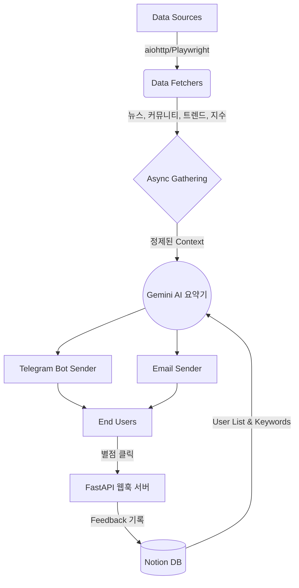

# 🚀 AI 주식 리포트 자동화 시스템 (Stock Report Automation)

이 프로젝트는 다양한 플랫폼(언론 기사, 검색 트렌드, 종목 커뮤니티 민심 등)의 방대한 주식 데이터를 수집하고, **Google Gemini (AI 모델)**을 활용해 각 사용자 맞춤형 인사이트 리포트를 요약해 **무료 푸시(이메일, 카카오톡/텔레그램)로 발송**하는 파이프라인입니다.

---

## 🔥 주요 특징 (Key Features)

### 1. 다양한 데이터 소스 다원화 병렬 크롤링

- **언론 뉴스**: 네이버/다음/구글 뉴스 크롤링 기반 병합 처리
- **시장 지수**: 실시간 KOSPI, KOSDAQ 수치 및 투자 주체별(개인, 외인 등) 동향 수집
- **검색 트렌드**: 네이버 데이터랩 주요 키워드 추출
- **커뮤니티 (민심 파악)**: 네이버 종토방, 디시 주식 갤러리 인기글, 레딧(WSB) 등 동적/정적 병렬 크롤러

### 2. 초개인화 AI 엔진 (Hyper-Personalization)

- **사용자 보유 종목 연계**: 글로벌 거시 시장 상황은 기본, **내 포트폴리오**가 시장에서 어떤 타격을 받고 있는지 연계 분석
- **Back-Testing Scoring**: 어제 AI가 내놓은 시황 예측과 오늘 시장을 대조하는 채점 보고서 생성 시스템

### 3. 고도화된 100% 무료 인프라 구조

- **Notion as Database**: 관리자 페이지도, 서버도 필요 없는 완전 무료 [Notion API] 구독자 연동.
- **GitHub Actions**: 3시간(크론) 주기를 통해 서버에 1원도 들이지 않고 파이프라인 자동 호출.
- **에러 핸들링 & 보안 심사**: `Webhook Signature` 검증을 통한 무분별한 별점 테러 차단 및 `Circuit Breaker`를 통한 타임아웃 API 데드락 방비 철저.

---

## 🏗 시스템 아키텍처



## 🛠 로컬 개발 환경 구성 및 실행 방법

### 1. 의존성 (Dependencies)

이 프로젝트는 초고속 패키지 매니저인 [`uv`](https://github.com/astral-sh/uv)와 `Python 3.13`을 기반으로 합니다.

```bash
# uv 패키지 매니저 설치
curl -LsSf https://astral.sh/uv/install.sh | sh

# 프로젝트 의존성 세팅 및 가상환경 구성
uv sync --frozen
```

### 2. 환경 변수 구성 (.env)

프로젝트 루트 폴더에 위치한 `.env.template`을 복사하여 `.env`를 만드세요.  
발급이 필요한 주요 `API Key`와 `Token` 값은 아래와 같습니다. 구체적 발급 방법은 `.env` 파일 내부 주석을 참고하세요.

```env
GEMINI_API_KEY="..."              # Google AI Studio
NOTION_TOKEN="..."                # 노션 서버 연동
NOTION_DATABASE_ID="..."          # 주소록 관리자 페이지
SENDER_EMAIL="..."                # 리포트 발송용 이메일
SENDER_APP_PASSWORD="..."         # 구글 계정 2단계 앱 비밀번호
TELEGRAM_BOT_TOKEN="..."          ...
WEBHOOK_SECRET="..."              # 랜덤 생성 텍스트 보안키
```

### 3. 단일 실행 (Manual Run)

즉시 스크립트를 수동으로 구동하여 리포트 발송까지 테스트하고 싶다면 다음 명령어를 사용하세요.

```bash
uv run python -m src.main
```

---

## 🐳 Docker 분산 환경 실행 (마이크로서비스)

피드백 별점 서버 (FastAPI)와 3시간 크론 파이프라인을 완전히 분리 구동하려면 로컬에 `Docker`가 설치되어 있어야 합니다.

```bash
# 컨테이너 빌드 및 백그라운드 런칭 (-d옵션)
docker-compose up -d --build

# 실행중인 서버 로그 체크
docker-compose logs -f feedback-server
```

---

## ✅ TODO & Workflow 상태 (Phase 5)

이 프로젝트는 다음의 개발과정(애자일) 관례를 통해 탄생했습니다.

- [x] **AI 성과 백테스팅 (완료)** : `backtesting_scorer.py` 구현
- [x] **Docker 분산 환경 세팅 (완료)** : `Dockerfile` 및 `docker-compose.yml`
- [x] **보안 검토 (완료)** : 피드백 수집기(HMAC-SHA256) 도입

_※ 프로젝트의 매일 갱신되는 작업 히스토리는 [logging](logging/) 폴더에 상세 기록되어 관리됩니다._
